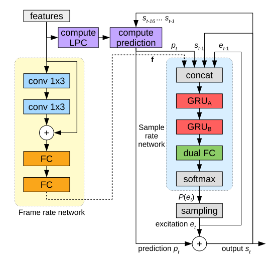

# LPCNet: Improving Neural Speech Synthesis Through Linear Prediction

Jean-Marc Valin, Jan Skoglund.

## Summary

- 효율성에 중심을 둔 LPC + WaveRNN 기밤 네트워크.
- topic words : LPC, WaveRNN, pre-emphasis, probability bias, efficiency, noise injection.
- base model : WaveRNN
- variation : LPC prediction
- benefits : 빠르고, 메모리 적게 들고 효율적.
- weakness : long term에 약함.
- future works : lon-term 개선.

## Abstract

LPCNet은 WaveRNN의 variation으로 linear prediction과 rnn을 결합, 굉장한 효율과 성능 향상을 보여줌. 

## 1. Introduction

초기 Neural Synthesis 알고리즘은 WaveNet 같은 것으로 high-end GPU에서 real-time으로 믿을만한 성능의 음성을 뽑아냈음.

근래에는 보다 유연하고 효율적인 모델을 만들기 위해 노력함. low bitrate vocoder 같은 low complexity parametric synthesis model은 기존까지 명맥을 이어오는데, 안타깝게도 quality에 한계가 있음. 이는 spectral envelope 을 linear prediction을 통해 예측할 수 있음에도, exitation을 예측할 수 없었기 때문.

LPCNet은 spectral envelope modeling과 excitation prediction 부분에서 nn의 capacity 대부분을 exitation modeling에 활용. 

## 2. WaveRNN

기존의 WaveRNN가 find/coarse splition을 이용했다면, 이번엔 나누지 않고 GRU + 2 x FC + softmax 꼴의 네트워크로 표현함. 또한, GRU의 효율성을 위해 sparse matrix를 활용함.

## 3. LPCNet

16kHz에서 작동하는 sample rate network와 10ms frames (160samples)를 처리하는 frame rate network를 작성. input feature은 18 Bark-scale cepstral coefficients + 2 pitch parameters. cepstrum과 pitch parameters는 quantized 하고, 연산에 이용.

### 3.1. Conditioning parameters

Auxiliary feature로 쓰기 위해 inputs를 frame rate network에서 encoding. 이는 나중에 sample-rate network에서 feature conditioning vector로 작용. 

### 3.2. Pre-emphasis and Quantization

WaveNet 같은 경우 8bit-mu-law를 이용. 대부분 음성이 low-frequency에 몰려 있기 때문에, mu-law로 인코딩 할경우 quantized 된 high freq signal에 의해 audible white noise가 발생 할 수 있음. 

1. 16bit를 이용하거나
2. 2. pre-emphasis filter를 이용 하거나.

$E(z) = 1 - \alpha z^{-1}$

$\alpha = 0.85$ 일 때 꽤 괜찮은 결과가 나옴. synthesizing 결과에 대해서는 de-emphasis filter (inverse filter)를 적용함

$D(z) = \frac{1}{1 - \alpha z^{-1}}$

이는 특히 Nyquist rate 에서 16db 가까이가 줄어듬. 8bit mu-law output에서도 perceived noise를 많이 줄일 수 있었음.

### 3.2. Linear Prediction

NN이 glottal pulses, noise excitation, vocal tract response 같은 음성 생성 전체 프로세스를 담당한다는 점에서 부담이 될 수 있음. 이 때 vocal tract tesponse는 all-pole linear filter에 의해서 적당히 잘 표현됨. 

$p_t = \sum^M_{k=1}a_k s_{t-k}$

Mth order linear prediction coeff $a_k$에 대해 과거 signal로 부터 현재 signal 을 linear하게 예측.

LPC 추출하기
1. 18 bark-freq cepstrum을 linear-frequency power spectral density (PSD)로 변환
2. PSD 를 ifft를 통해 auto correlation으로 변환
3. Levinson-Durbin 알고리즘을 통해 predictor를 연산함.

이렇게 연산된 predictor는 추가 정보를 요구하지 않음.

predictor를 통해 연산한후 residual는 NN을 통해 연산. 이 때 mu-law의 noise를 pre-emphasis filter를 통해 정리했기 때문에, excitation aplitude 가 작아서 충분함.

### 3.4. Output layer

dual fully-connected 로 정의

$dual_fc(x) = a_1 \circ tanh(W_1x) + a_2\circ tanh(W_2x)$

W1, W2는 matrix, a1, a2는 단순 element-wise weighting vector. output이 quantization interval 같은 특정 범위에 떨어지기 위해선 두 비교 대상이 필요하다고 함. 

### 3.5. Sparse Matrix

GRU는 크게, sparse 하게 잡음. diagonal term은 최대한 살리는 방향으로 16x1 block을 가져다 씀.

### 3.6. Embedding and Algebraic Simplifications

mu-law의 각 값을 embedding 하여 이용. 최종적으로 embedding matrix를 열어 보니까 Mu-law value를 linear scale로 바꾸는 역할을 잘 수행했음.

이 때 이걸 그냥 gru에 넣지 않고, embedding matrix와 weight matrix를 사전에 연산하여 복잡도를 줄일 수 있음. 

### 3.7. Sampling from probability distribution

$c = 1 + \max (0, 1.5g_p - 0.5) \\
P'(e_t) = R(\max [R(P(e_t))]^c) - T, 0$

이 때 g_p는 pitch correlation, R은 renormalizer. T를 통해 일정 threshold 이하의 확률을 0으로 만듬.

### 3.8. Training Noise Injection

robustness를 위해 input에 noise를 삽입. input에 noise를 삽입하지만, 네트워크가 clean exitation 환경에서 학습돼었으면 artifact가 발견됨. 노이즈는 uniform에서

## 4. Evaluation

## 5. Conclusion

efficient한 모델을 만들 수 있었고, 다음엔 long-term prediction에 도전할 것.

## 6. Citation

## 7. 단어

- spectrum: FFT를 통해 나온 freq 도메인
- spectral envelope: spectrum을 완만한 곡선으로 이은 것.
- spectral details: spectrum 에서 envelope을 뺀 값 (excitation ?)
- psd: power가 time-series 내에 어떻게 분포하고 있는지
- autocorrelation: 시그널 내에서의 correlation