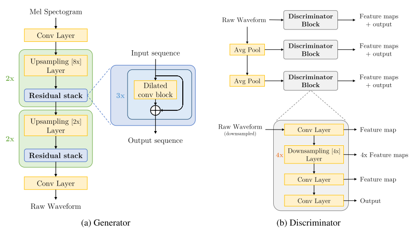

# MelGAN: Generative Adversarial Networks for Conditional Waveform Synthesis

Kundan Kumar, Rithesh Kumar, Thibault de Boissiere, Lucas Gestin, Wei Zhen Teoh, Jose Sotelo, Alexandre de Brebisson, Yoshua Bengio, Aaron Courville

## Summary

- 굉장히 많은 실험으로 구축한 GAN을 활용한 보코더.
- topic words : dilated conv stack, weight norm, window-based discriminator loss, feature matching loss.
- base model : - 
- variation : -
- benefits : fully-convolutional, non-autoregressive, fast train, fast inference.
- weakness : input, output vector의 크기 제한.
- future works : 길이 제한 해소, unconditional synthesis 학습.

## Abstract

GAN을 통해서 high quality coherent waveforms를 간단한 training framework에서 학습할 수 있는 것을 보일것임. mel inversion에 효과적이었음. ablation studies에서 모델의 컴포넌트를 뜯어볼 것. non-autoregressive 하고 fully-convolutional 이며 parameters 수가 적음. 

## 1. Introduction

raw audio를 모델링하는 것이 어려운 이유는 1초에 16kHz 샘플을 뽑는만큼 temporal resolution이 높은 편. 또한 short-term, long-term 등 서로 달느 timescale에서 structure dep이 존재함. 그래서 더 쉽게 연산하려고 lower-resolution으로 줄여서 연산한거. 이게 mel 같은거. 이건 inversion을 할 수 있을만큼 충분한 정보를 담고 있는 repr이어야 함. 

주로 두가지 단계로 모델링이 들어가는데 text2mel, mel2audio 이런 느낌. 이 때 mel 대신에 bark-cepstrum 같은 다른 intermediate를 쓰기도 함. 

모델은 크게 3개로 봄.

**Pure signal processing approaches** 

griffin-lim 같은 algorithmic한 방법론. stft sequence를 다시 signal로 복원하는 메소드. 더 나아가서는 WORLD vocoder 에서는 mel-like intermediate를 소개하고, dedicated signal과 함께 원본 시그널로 복원하는 역할을 함. Char2Wav의 보코더로도 채용됨.

**Autoregressive neural-networks-based models**

WaveNet 은 fully-convolutional autoregressive sequence model. 하지만, receptive field의 한계로 몇 초 이상의 dependency는 어려움. 이걸 해결하기 위한게 SampleRNN. 얘는 multi-scale에서 different resolution에 대해 모델링. WaveRNN은 single recurrent entwork, 여러 테크닉을 통해 가속화한 모델. 전체적으로 추론 단계에서 느리고 비효율적인 샘플링 방식을 가짐. 

**Non autoregressive models**

autoregressive한 시퀸스 사이의 dependency가 없기 때문에 parallelizable하고, deep learning hardware 사용량을 늘릴 수 있음.

1. Parallel WaveNet and Clarinet

이건 autoregressive 방식으로 train한 모델을 flow-based convolutional student model에 nn distillation한 것. 기본적으로 KL을 쓰고 부가적인 perceptual loss를 가짐

2. WaveGlow

Glow와 같은 flow based model을 이용. 근데 8개 GPU로 1주일이 걸릴만큼 학습이 느림. 이게 autoregressive 방식인 AF는 inf 단계에서 autoreg가 발생하고, train에서 parallel하게 작동하고, IAF는 inf에서 parallel하게 작동하고, train에서 autoreg가 발생. 그래서 이걸 싹 정리한게 WaveFlow. 

**GANs for audio**

GAN이 vision에서 큰 영향을 미친 것과 별개로, audio 분야에서는 드믐. Yamamoto는 autoregressive 모델에서 distillation을 GAN을 통해서 진행했는데, adversarial loss 만으로는 부족했고, KL 기반의 distillation objective가 필요했음.

**Main Contributions**

- MelGAN이란 모델을 소개할거고, non-autoregressive feed-forward convolutional arch이며 GAN 베이스로 동작. GAN으로 distillation 이나 perceptual loss 없이 학습한 첫 작
- parallel MelGAN decoder 로 autoregressive 모델이 대체될 것.
- MelGAN이 제일 빠름.

## 2. The MelGAn Model

### 2.1. Generator

**Architecture**

generator은 mel s 를 raw waveform x 를 뽑느 fully convolutional feed-forward network. 기본 x256 lower resol mel을 가정. upsampling layer은 transposed conv, 뒤에 dilated residual conv blocks. 

기존 GAN과 달리 noise를 이용하지 않음. noise를 추가했을 때 perceptual difference가 존재했음. 이게 실제 기존 Mathieu et al., 2015, Isola et al., 2017의 논문에서 봤든 conditioning info가 굉장히 강한 경우 noise vector가 큰 영향을 끼치지 못했음. 

**Induced Receptive Field**

induced receptive field에 의해 이미지 내에서 spatial하게 가까운 두 픽셀은 correlation에 의해 inductive bias를 가짐. 이랑 마찬가지로 제안한 gen은 audio timestep에 대해 long range correlation을 가지고,이를 통해 inductive bias를 가짐. dilated conv을 이용한 res block에 의해 먼 input과 output 사이에도 overlapping이 발생시키고, 이로 인한 long-range correlation (dependency)를 의도함. 

**Checkerboard artifacts**

deconv는 kernel size랑 stride를 적절히 조정하지 않으면 checkerboard-pattern이 발생할 수 있음. 이건 audio 분야에서도 발생할 수 있고, 노이즈로써 작용할 수 있음. 이를 해결하기 위해 PhaseShuffle layer를 도입. kernel size는 stride의 배수로 채택하고, dilation은 kernel-size의 N제곱수의 배수로 설정. 이를 통해 receptive field의 형태가 fully balanced symmetric tree가 되도록 의도함. 

**Normalization technique**

normalization이 음성 퀄리티에 굉장한 영향을 미쳤음. 유명 cond gan 관련 논문 (isola et al., 2017; Wang et al., 2018b) 에서는 모든 레이어에 instance norm을 적용. 근데 음성에서는 pitch 정보를 날릴뿐이었음. spectral noramlization도 효과가 없었음.

저자들은 disc에 적용된 strong Lipshitz constraint가 feature matching objective에 영향을 미친다 가정하였음. 그래서 적용한게 weight normalization 이었고, 얘는 disc의 capacity를 줄이거나, activation을 normalize하지 않았음. 모든 제너레이터에 weight norm을 적용.

### 2.2. Discriminator

**Multi-Scale Architecture**

Wang et al. (2018b)에 따라 multi-scale disc를 차용하였고, 3개 disc ($D_1, D_2, D_3$)에 대해 $D_1$은 raw audio에 대해서, $D_2$는 2배 downsampling, $D_3$는 4배 downsampling하여 판단. downsampling은 strided average pooling(k=4) 활용. 이는 사전에 이야기한 가정, 오디오가 multi-scale에서 각 서로 다른 structure를 가진다, 에서 motivating 하였음. 

**Window-based obejctive**

Isola et al. (2017)와 motivation이 비슷한 window-based discrimator을 활용. large kernel size를 가지고 돌리고, receptive-field만큼의 audio chunk를 대상으로 disc 한다고 생각하면 될 듯. 근거는 high frequency structure를 잘 캡쳐했고, 파라미터 수가 적으며, 빠르게 작동하고, variable length audio seq에도 작동할 수 있음. weight norm도 모든 disc layer에 적용됨.

### 2.3. Training objective

$\min_{D_k} \mathbb E_x[(D_k(x) - 1)^2] + \mathbb E_{s,z}[D_k(G(s, z))^2], \forall k=1, 2, 3\\
min_G \mathbb E_{s, z}[\sum_{k=1, 2, 3}(D_k(G(s, z)) - 1)^2]$

z는 gaussian noise이지만, 실질적으로 사용하진 않는듯.

**Feature matching**

generator 학습을 위해 feature matching objective 활용. disc feature map을 기준으로 l1 loss. output에 대해서는 취하지 않는데, 실험적으로 noise가 발생하고, audio quality를 떨어뜨렸음을 확인할 수 있었음.

$\mathcal L_{FM}(G, D_k)=\mathbb E_{x,s \sim p_{data}}[\sum^T_{i=1}\frac{1}{N_i}||D^{(i)}_k(x) - D^{(i)}_k(G(s))||_1]$

이 때 여기서 $D^{(i)}_k$는 ith layer feature map, kth disc, $N_i$는 ith layer의 output 크기. perceptual loss 와 유사.

$\min_G(\mathbb E_{s,z} [\sum_{k=1, 2, 3}(D_k(G(s, z)) - 1)^2] + \lambda \sum^3_{k=1}\mathcal L_{FM}(G, D_k))$

### 2.4. Number of parameters 

inductive bias를 활용한 아키텍쳐기에 파라미터수를 확 줄일 수 있었음. 

## 3. Results

### 3.1. Ablation Study

dilated conv stack이나 weight norm을 지우면 high frequency에 문제가 생기고, single disc를 쓰면 metallic audio가, 심지어는 몇가지 단어를 씹기도 했음. spectral norm을 쓰거나 window-based discloss를 지우면 sharp high freq pattern을 학습하는데 어려웅믈 겪음. 결과적으로 noisy output이 발생. L1 penalty를 audio 단에 쓰면 metallic + high freq 문제가 발생했음.

## 4. Conclusion and future works

MelGAN은 lightweight, quick training, fast inference. plug-and-play도 가능할 것.

time aligned information이라는 한계가 존재하긴 함. output이 input의 배수여야 함. feature matching lose도 몇몇 상황에서는 썩 좋지 않을 수 있음. unconditional 하게 뽑는거도 future work. 

## 5. Citation
- WORLD vocoder: MORISE et al., 2016.
- SampleRNN: Mehriet al., 2016.
- Clarinet: Ping et al., 2018.
- Probability density distillation with generative adversarial networks for high-quality parallel waveform generation: Yamamoto et al., 2019.
- Phase shuffle layer: Donahue et al., 2018b.
