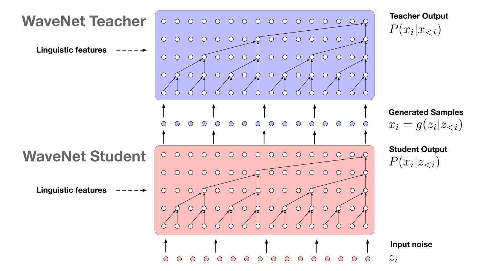

# Parallel WaveNet: Fast High-Fidelity Speech Synthesis

Aaron van den Oord, Yazhe Li, Igor Babuschkin, Karen Simonyan, Oriol Vinyals, Koray Kavukcuoglu.

## Summary

- nn distillation 으로 pretrained wavenet을 IAF 형태의 wavenet에 정보 전달, KL Loss 로는 부족해서 perceptual loss를 추가로 학습해야 했음.
- topic words : distillation, IAF, cross entropy, KL, power, perceptual, constrative loss.
- base model : wavenet
- variation : IAF information distillation
- benefits : inference 속도 향상
- weakness : 복잡한 loss framework
- future works :

## Abstract

WaveNet이 Sequential 한 생성 단계 때문에 parallel computers에 잘 안 맞고 real-time에 안 뽑힘.
=> Probability density distillation을 이용해서 parallel 하게 wavenet을 돌리는 것이 목적.

## 1. Introduction

WaveNet이 SOTA를 이루긴 했지만, 리얼 월드에서는 생성 속도의 한계에 부딫힘. 이를 distilling 해서 feed-forward하게 바꿔봄.

현재는 24kHz의 sample rate로도 돌아가니 autoregression이 어려움. 그래서 영감을 얻은게 IAF (WaveFlow 같은거). WaveNet이랑 IAF의 장점만 모으기 위해 neural network distillation이 필요했고, 이를 probability density distillation 이라 하기로 함. 그리고 이게 feedforward IAF의 teacher로 활용될 것.

## 2. WaveNet

$p(x)=\prod_tP(x_t|x_{<t},\theta)$

과거 시퀸스 전체를 조건화해서 output을 만듬. 전형적인 autoregressive.

$p(x_t|x_{<t})$를 만들기 위해 한번의 forward pass가 요구됨. 이 때 쓰이는게 causal dilated conv. 근데 이게 학슴 때는 모든 정보를 가지고 있으니까 gpu 수준에서 parallel 하게 연산이 가능한데, synthesis 에서는 unit 하나 당 forward pass가 요구되니 굉장히 느림.

현대는 16~24kHz 정도의 sample rate를 가지기 때문에 이런 signal의 long-term dep을 모델링 하기 위해선 네트워크가 엄청 깊어져야 하고, 이를 메꾼게 dilation.

gated activation 을 강조한거 보니까 이게 꽤 유의미 했나봄.

### 2.1. Higher Fidelity WaveNet

audio quality를 높이기 위해 mu-law 16비트로 쓰고 softmax 대신에 discretized mixture of logistics distribution 을 활용함. 또한, 16kHz에서 24kHz로 sample rate도 높임. 보다 넓은 receptive field를 위해 filter size도 3으로 키움. 

## 3. Parallel WaveNet

IAF는 stochastic generative model 이고 latent variables에 의해 모든 sample이 parallel 하게 학습될 수 있음.

IAF는 normalising flow는 multivariate $P_X(x)$ 랑 explicit invertible non-linear f, tractable latent $P_Z(z)$ (주로 isotropic gaussian)을 가지고 log prob을 계산.

$logP_X(x)=logP_Z(z)-log|\frac{dx}{dz}|$

IAF 에서 $x_t$는 $p(x_t|z_{\le t})$ 이고, $x_t=f(z_{\le t})$로 계산됨. 그럼 jacobian은 triangular고, determinant는 diagonal term의 product.

$z\sim Logistic(0, I)$ 에서 샘플링. 이때 f를 invertible하게 만들기 위해 $x_t=z_t\cdot s(z_{<t},\theta)+\mu(z_{<t}, \theta)$ 로 두고 stddev s랑 mean mu 를 뉴럴넷으로 뽑는 방식. 이걸 wavenet으로 썼나봄. 이게 IAF랑 autoregressive model이 동일 output dist를 가지는걸 목표로 했었음. 하지만, 실제로는 조금의 차이를 보임. 이를 정확히 맞추기 위해서는 $x_t$를 추론할 떄 IAF가 묵시적으로 $z_1,...,z_{t-1}$에 대한 output $x_1,...,x_{t-1}$를 알 수 있어야 함. 그래야 모든 $x_t$가 병렬로 만들어질 수 있음.

normalizing flow도 여러 stage를 가질 수 있는데 야는 그래도 wavenet보다는 준수한편. 실험적으로는 4번 정도. 최종적으로는 flow와 weight을 공유하지 않음. 최종적으로 $p(x_t|z_{<t},\theta)$는 $\mu_{tot}$이랑 $s_{tot}$에 기반함.

$\mu_{tot}=\sum^N_i \mu^i(\prod^N_{j>i}s^j)$

$s_{tot}=\prod^N_i s_i$

## 4. Probability Density Distillation

NN distillation을 할건데 사전에 학습된 WaveNet을 teacher로 두고, parallel WaveNet을 student로 학습하게 하는 방식. 이를 probability density distillation이라고 할거임. teacher가 학습한 분포를 student가 맞추는 방식.

student 분포 $p_S(x)$와 teacher 분포 $p_T(x)$에 대해 probability density distillation loss는 dkl로 정의.

$D_{KL}(P_S||P_T) = H(P_S, P_T) - H(P_S)$

얘를 minimize하는 방식으로 학습. 여기서 뒤에 엔트로피 텀은 mode collapse를 방지하기 위함. 이건 GAN이랑도 역할이 비슷한데, student가 generator, teacher가 discriminator의 역할. 다른점은 student가 teacher을 속이는 adversarial 방식이 채택되지 않은 점. 단순히 teacher의 probability를 따르는 방식. teacher은 student 학습 중에는 freezing. 

$H(P_S)\\
=\mathbb E_{z\sim L(0, 1)}[\sum_{t=1}^T-\ln p_S(x_t|z_{<t})]\\
=\mathbb E_{z\sim L(0, 1}[\sum_{t=1}^T\ln s(z_{<t}, \theta)]+2T$

이 때 두번쨰 formula가 나온 이유는 logistic dist의 entopry 가 $\ln s + 2$이기 때문. 이에 x를 생성하지 않아도 s만으로 엔트로피 연산 가능.

$H(P_S, P_T)
\\=\int_x p_S(x)\ln p_T(x)
\\=\sum^T_{t=1}\int_x p_S(x)\ln p_T(x_t|x_{<t})
\\=\sum^T_{t=1}\int_x p_S(x_{<t})p_S(x_t|x_{<t})p_S(x_{>t}|x_{\le t})\ln p_T(x_t|x_{<t})
\\=\sum^T_{t=1}\mathbb E_{p_S(x_{<t})} [\int_{x_t} p_S(x_t|x_{<t})\ln p_T(x_t|x_{<t})\int_{x_{>t}}p_S(x_{>t}|x_{\le t})]
\\=\sum^T_{t=1}\mathbb E_{p_S(x_{<t}) H(p_S(x_t|x_{<t}), p_T(x_t|x_{<t}))}$

cross entropy는 명시적으로 $x_t$를 요구함. 스튜던트에서 샘플링을 한 $x_{<t}$를 가지고 teacher에서 $x_t$ 확률 계산, 엔트로피 계산. 이 때 sampler는 더 lower variance estimator가 됨. $p_T(x_t|x_{<t})$ 가 mixture of logistics를 이용해야 모든 로스가 differentiable하고 categorical의 경우 $x_{<t}$에 대해서만 differentiable.

### 4.1. Additional Loss term

**Power Loss**

서로 다른 frequency band의 power를 human speech의 평균에 맞추는 작업. 이건 high-entropy wavenet-mode에 collapse하지 않도록 함. ex) whispering

$||\phi(g(z, c))-\phi(y)||^2, \phi(x)=|STFT(x)|^2$

phi(x)가 시간축에 대해 평균을 가지게 되는데, 이걸 다양한 frequency 대역에서의 average power로 해석하고 이걸 중요하게 보는 듯.

**Perceptual loss**

power loss formulation에서 stft 대신에 neural net으로 signal의 perceptual property를 total energy 대신에 지키는 방식으로 돌릴 수도 있는데, 여기서는 raw-audio2phoneme wavenet-like classifier를 통해서 부정확한 발음을 잡아냈다고 함. 

style transfer 때처럼 feature reconstruction loss (feature map 사이에 l2) 하고 gram matrices 기반 style loss 도 추가해봤는데, 뒤에게 더 실험이 잘 나오더라.

**Constrative loss**

$D_{KL}(P_S(c_1)||P_T(c_1))-\gamma D_{KL}(P_S(c_1)||P_T(c_2))$

동일 conditional info $c_1$에 대해서는 dkl이 줄어드는 방향으로, 다른 conditioning info $c_2$에 대해서는 증가하는 방향으로 학습. $\gamma$는 0.3 정도로 세팅. 이건 conditioning vector의 영향력을 충분히 주기 위해. 

## 5. Experiments

1M step Adam, 32 mini batch with 7680 timesteps, lr $2\times 10^{-4}$, polyak averaging, 30 layers, 3 dilated cycle, dilation 1 ~ 512, kernel size 3, 256 x 2 gated activation, 10 mixture logistics output distribution. 

KL 만으로는 distillation으로 충분히 좋은 sound를 얻을 수 있음. kl loss + perceptual loss 가 좋은 성능 향상을 보였음. 

## 6. Conclusion

단순 정리

## 7. Acknowledgements

## 8. Citation

1. PixelCNN++ (discretized mixture of logistics distribution): Tim Salimans et al., 2017
2. Normalizing flows
    - Non-linear independent components estimation: Laurent Diinh et al., 2014
    - Density estimation using real nvp: Laurent Dinh et al., 2016.
    - Variational inference with normalizing flows: Danilo Jimenez et al., 2015.
3. Acceleration of stochastic approximation by averaging: Boris T Polyak et al., 1992.
