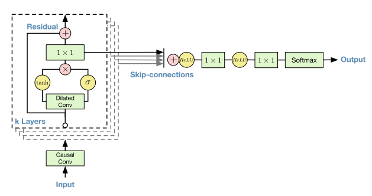

# WaveNet: A Generative Model for Raw Audio

Aaron van den Oord, Sander Dieleman, Heiga Zen, Karen Simonyan, Oriol Vinyals, Alex Graves, Nal Kalchbrenner, Andrew Senior, Koray Kavukcuoglu

## Summary

- fully conv + causal dilation 을 도입한 autoregressive TTS 모델
- topic words : fully causal dilated convolution, autoregressive
- base model : pixelcnn
- variation : 
- benefits : 좋은 성능을 보이고, 학습시간이 빠름.
- weakness : autoregressive하게 매번 convolution을 시행하기 때문에 inference 단계가 느림.
- future works : inference 가속화

## Abstraction

WaveNet을 소개할거고, fully probabilistic 하고 autoregressive 하다.
speaker characteristics도 캡쳐할 수 있어서 아이덴티티 조건화해서 성격을 바꿀 수 있다.
생성 말고도 discriminative model 에서도 잘 이용할 수 있더라.

## 1. Introduction

이 연구의 목적은 raw audio 생성이 목적.
기존까지 픽셀 하고 워드 단위에서 NN이 cond dist의 joint를 학습하는데 효과적으로 쓰였음.

WaveNet은 pixelcnn 기반
- tts 에서 괜찮은 성능을 보임
- long-range temp dep을 구성하기 위해 dilated causal conv로 receptive field를 키움
- speaker identity 로 싱글 모델에 다양한 보이스
- 음악이나 recognition에서도 강한 모습을 보임 

## 2. WaveNet

$p(x)=\prod^{T}_{t=1}p(x_t|x_1,...,x_{t-1})$

wavenet은 바로 raw audio waveform을 뽑음. 이전까지 모든 시퀀스를 컨디션으로 하는 확률 함수의 곱으로 표현. 그리고 이걸 conv로 모델링. pooling 없이 돌리고, 막단에 softmax, mle를 objective로 학습. 

### 2.1. Dilated causal convolutions

prediction $p(x_{t+1}|x_1,...,x_t)$ 은 어떤 미래 정보에도 dep 하지 않음. 그렇기 때문에 conv 과정에서도 미래 정보를 masking 하고 난 후에 conv를 진행해야 하는데, 이는 일반적인 conv의 output을 단순히 일정 timestep을 shifting하여 sampling한 것과 동치. 이를 causal conv.

학습 시간에는 모든 정보를 알고 있고, recurrent connection이 없기 때문에 RNN 보다 빠름. 한가지 문제는 receptive field를 넓히기 위해서 많은 양의 레이어가 필요. 이를 좀 줄이기 위해 dilated conv를 활용함.

dilated conv는 특정 위치의 input을 skipping하며 conv 입력을 재구성하는 방식. 언뜻보면 pooling이나 striding과 유사하나 output scale이 같다는 점에서 차이.

stacked dilated conv는 일반적인 네트워크보다 적은 레이어 수에서 더 넓은 receptive field를 구성함. 이는 comp efficiency를 만들어냄.

이 페이퍼에서는 dilate cycle을 두고 여러 싸이클을 반복하는 방식. 

### 2.2 Softmax distributions

Cond dist를 모델링 하기 위해선 주로 mixture model 활용. 그리고 요것들이 보여준게 softmax dist가 implicitly continuous 한 데이터에서도 잘 작동하드라. categorical dist가 유연한 이유는 임의의 dist를 모델링하기 쉽고, 그 모양에 대한 가정이 필요가 없음.

softmax가 16비트에서 65536개 샘플을 만들기 어려우니까 mu-law를 가지고 8비트로 압축.

$f(x_t)=sign(x_t)\frac{ln(1+\mu|x_t|)}{ln(1+\mu)}$

이 때 x_t는 -1 ~ 1 사이, mu = 255. non-linear quant가 단순한 linear quant보다 복원력이 더 좋았음.

### 2.3. Gated Activation Units

$z=tanh(W_{f,k}*x)\odot\sigma(W_{g,k}*x)$

PixelCNN에서 쓰던 gated activation 활용. W는 conv. 이게 ReLU 보다 더 오디오 시그널에 유연.

### 2.4. Residual And Skip Connections.

각 레이어간 전달은 residual connection, network output은 skip connection 해서 1x1 conv + ReLU + Softmax 로 연결

### 2.5. Conditional WaveNets

additional input h에 대해서 두가지 방법론 제시.

첫번째는 global conditioning, latent h 를 모든 timestep에 적용

$z=tanh(W_{f,k}*x + V^T_{f,k}h)\odot\sigma(W_{g,k}*x+V^T_{g,k}h)$

이 때 V는 learnable linear projection, $V^T_{*,k}h$는 time dimension broadcasting.

두번째 local conditioning, 이건 h가 time series 일 때 transposed conv 를 통해 y=f(h)를 가정하고 1x1 conv V를 활용.

$z=tanh(W_{f,k}*x + V_{f,k}*y)\odot\sigma(W_{g,k}*x+V_{g,k}*y)$

### 2.6. Context stacks

전체에 대해 conditioning 하는게 아니라 부분에 대해 condition하고, 여러 부분 길이에 대해 여러가지 context를 stacking해서 이용.

## 3. Experiments

## 4. Conclusion

1. autoregressing + causal dilated conv
2. exponentially growing receptive field
3. conditioning
4. TTS 잘 하드라

끝

## 5. Citation

1. PixelRNN : van den Oord et al., 2016a
2. PixelCNN : van den Oord et al., 2016b
3. Dilated convolution in signal processing
   - Holschneider et al., 1989
   - Dutilleux, 1989
4. Image segmentation with dilated conv
   - Chen et al., 2015
   - Yu & Koltun, 2016
5. Mixture density network : Bishop, 1994
6. Mixture of Conditional Gaussian scale mixtures : Theis & Bethge, 2015
7. mu-law compading transformation : ITU-T, 1988